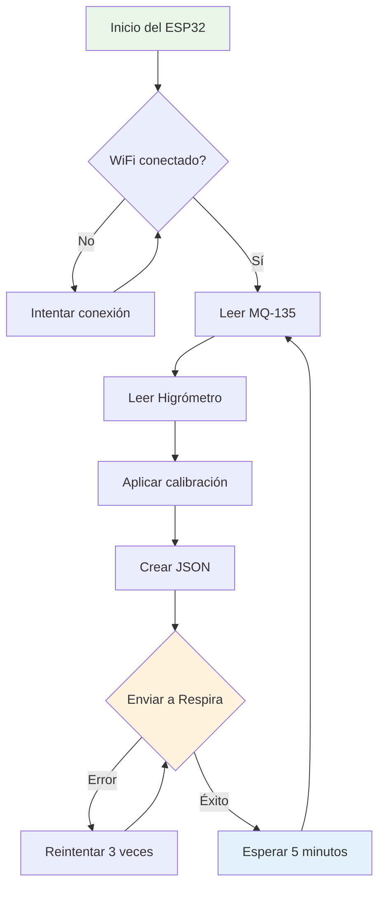

# 💻 Código del proyecto
{: .no_toc }

Programas desarrollados en Arduino IDE para calibración de sensores y envío de datos a la plataforma Respira.
{: .fs-6 .fw-300 }

## Tabla de contenidos
{: .no_toc .text-delta }

1. TOC
{:toc}

---

## 📁 Estructura del código

El proyecto consta de dos programas principales:

```
src/
├── calibracion.ino          # Calibración de sensores
└── respira_codigo.ino       # Código principal de producción
```

---

## 🧠 Programa de calibración

### Propósito

Este código permite obtener los valores mínimos y máximos de cada sensor para establecer rangos de referencia:

- **MQ-135:** Aire limpio vs aire contaminado
- **Higrómetro:** Suelo seco vs suelo húmedo

### Características

- ✅ Lectura continua de sensores
- ✅ Muestra valores en tiempo real por monitor serial
- ✅ Permite identificar valores base y máximos
- ✅ No requiere conexión WiFi

### Código fuente

[📄 Ver código completo: `calibracion.ino`](https://github.com/marlilycelis/sena-proyecto-respira/blob/main/src/calibracion.ino){: .btn .btn-blue }

### Ejemplo de uso

```cpp
// Fragmento del código de calibración
const int MQ135_PIN = 34;
const int HIGROMETRO_PIN = 35;

void setup() {
  Serial.begin(115200);
  pinMode(MQ135_PIN, INPUT);
  pinMode(HIGROMETRO_PIN, INPUT);
}

void loop() {
  int valorMQ135 = analogRead(MQ135_PIN);
  int valorHigrometro = analogRead(HIGROMETRO_PIN);
  
  Serial.print("MQ-135: ");
  Serial.print(valorMQ135);
  Serial.print(" | Higrómetro: ");
  Serial.println(valorHigrometro);
  
  delay(2000);
}
```

### Proceso de calibración

{: .note-title }
> Pasos para calibrar correctamente

1. **Carga el código** en el ESP32
2. **Abre el monitor serial** (115200 baudios)
3. **Para el MQ-135:**
   - Expón el sensor a aire limpio (exterior)
   - Anota el valor mínimo durante 5 minutos
   - Expón cerca de gases (alcohol, humo ligero)
   - Anota el valor máximo
4. **Para el Higrómetro:**
   - Coloca en tierra completamente seca
   - Anota el valor (suelo seco)
   - Coloca en tierra muy húmeda (no agua directa)
   - Anota el valor (suelo húmedo)
5. **Registra estos valores** para usarlos en el código principal

{: .warning }
**Importante:** El MQ-135 necesita ~24 horas de calentamiento previo para lecturas estables.

---

## 🌐 Código principal (Producción)

### Propósito

Programa final que:
- Conecta el ESP32 a WiFi
- Lee los sensores calibrados
- Envía datos a la plataforma Respira vía HTTP
- Maneja reconexión automática

### Características

- ✅ Conexión WiFi automática
- ✅ Envío periódico de datos (cada 5 minutos)
- ✅ Manejo de errores y reintentos
- ✅ Indicadores LED de estado
- ✅ Mapeo de valores calibrados

### Código fuente

[📄 Ver código completo: `respira_codigo.ino`](https://github.com/marlilycelis/sena-proyecto-respira/blob/main/src/respira_codigo.ino){: .btn .btn-green }

### Configuración WiFi

```cpp
// Credenciales de red
const char* ssid = "TU_RED_WIFI";
const char* password = "TU_CONTRASEÑA";

// Configuración Respira
const char* servidor = "calidadmedioambiental.org";
const String deviceID = "WEMOS_001_SENA_PASTO";
```

{: .important }
> **Debes modificar estos valores** antes de cargar el código:
> - `ssid`: Nombre de tu red WiFi
> - `password`: Contraseña de la red
> - `deviceID`: Identificador único de tu dispositivo

### Envío de datos

```cpp
// Estructura JSON enviada a Respira
{
  "device": "WEMOS_001_SENA_PASTO",
  "data": {
    "airQuality": 45.8,      // Calidad del aire (0-100)
    "soilMoisture": 62.3     // Humedad del suelo (%)
  },
  "timestamp": "2025-11-06T10:30:00Z"
}
```

### Frecuencia de envío

- **Intervalo:** 5 minutos (configurable)
- **Protocolo:** HTTP POST
- **Formato:** JSON
- **Puerto:** 80

---

## 🔄 Flujo del sistema

Diagrama del funcionamiento completo del código:



---

## 📊 Mapeo de valores

### Sensor MQ-135

```cpp
// Valores obtenidos en calibración
const int MQ135_MIN = 500;   // Aire limpio
const int MQ135_MAX = 2000;  // Aire contaminado

// Mapeo a escala 0-100
int calidadAire = map(valorMQ135, MQ135_MIN, MQ135_MAX, 0, 100);
calidadAire = constrain(calidadAire, 0, 100);
```

### Sensor Higrómetro

```cpp
// Valores obtenidos en calibración
const int HIG_SECO = 3000;   // Suelo seco
const int HIG_HUMEDO = 1000; // Suelo húmedo

// Mapeo a porcentaje (invertido)
int humedad = map(valorHig, HIG_SECO, HIG_HUMEDO, 0, 100);
humedad = constrain(humedad, 0, 100);
```

---

## 🛠️ Instalación del código

### Requisitos previos

1. **Arduino IDE** instalado (versión 2.0+)
2. **Soporte ESP32** instalado:
   - Archivo → Preferencias
   - URLs adicionales: `https://dl.espressif.com/dl/package_esp32_index.json`
   - Herramientas → Placa → Gestor de tarjetas → Buscar "ESP32" → Instalar

3. **Bibliotecas necesarias:**
   - WiFi.h (incluida con ESP32)
   - HTTPClient.h (incluida con ESP32)
   - ArduinoJson (instalar desde gestor de bibliotecas)

### Pasos de instalación

{: .highlight }
1. **Clona el repositorio:**
   ```bash
   git clone https://github.com/marlilycelis/sena-proyecto-respira.git
   ```

2. **Abre `calibracion.ino`** en Arduino IDE

3. **Selecciona la placa:**
   - Herramientas → Placa → ESP32 Arduino → "ESP32 Dev Module"

4. **Configura el puerto:** Herramientas → Puerto → (tu puerto COM)

5. **Carga el código** de calibración primero

6. **Después, abre y carga** `respira_codigo.ino` con tus credenciales

---

## 🐛 Solución de problemas

### Error: "WiFi no conecta"

```cpp
// Añade debug en setup()
Serial.begin(115200);
WiFi.begin(ssid, password);

Serial.print("Conectando a WiFi");
while (WiFi.status() != WL_CONNECTED) {
  delay(500);
  Serial.print(".");
}
Serial.println("\n¡Conectado!");
```

### Error: "Sensor devuelve valores extraños"

- Verifica las conexiones físicas
- Revisa el divisor de voltaje
- Espera 24h de calentamiento (MQ-135)
- Recalibra los sensores

### Error: "No envía datos a Respira"

```cpp
// Verifica la respuesta del servidor
HTTPClient http;
http.begin(url);
int httpCode = http.POST(payload);

Serial.print("Código HTTP: ");
Serial.println(httpCode);
Serial.println(http.getString());
```

---

## 📚 Recursos adicionales

- [Documentación ESP32](https://docs.espressif.com/projects/arduino-esp32/en/latest/)
- [API Respira](https://panstamp.github.io/respira_fiware/)
- [Librería ArduinoJson](https://arduinojson.org/)

---

[← Volver a Conexiones](conexiones){: .btn .btn-outline }
[Ir a Autores →](autores){: .btn .btn-purple }