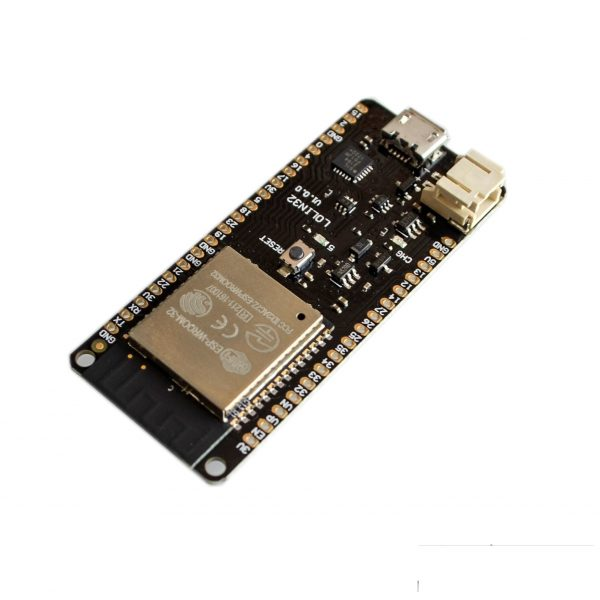
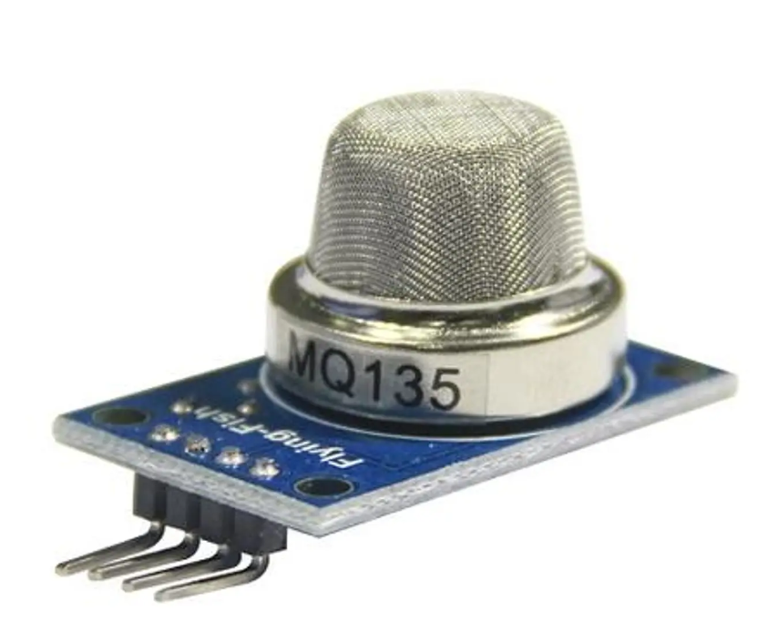
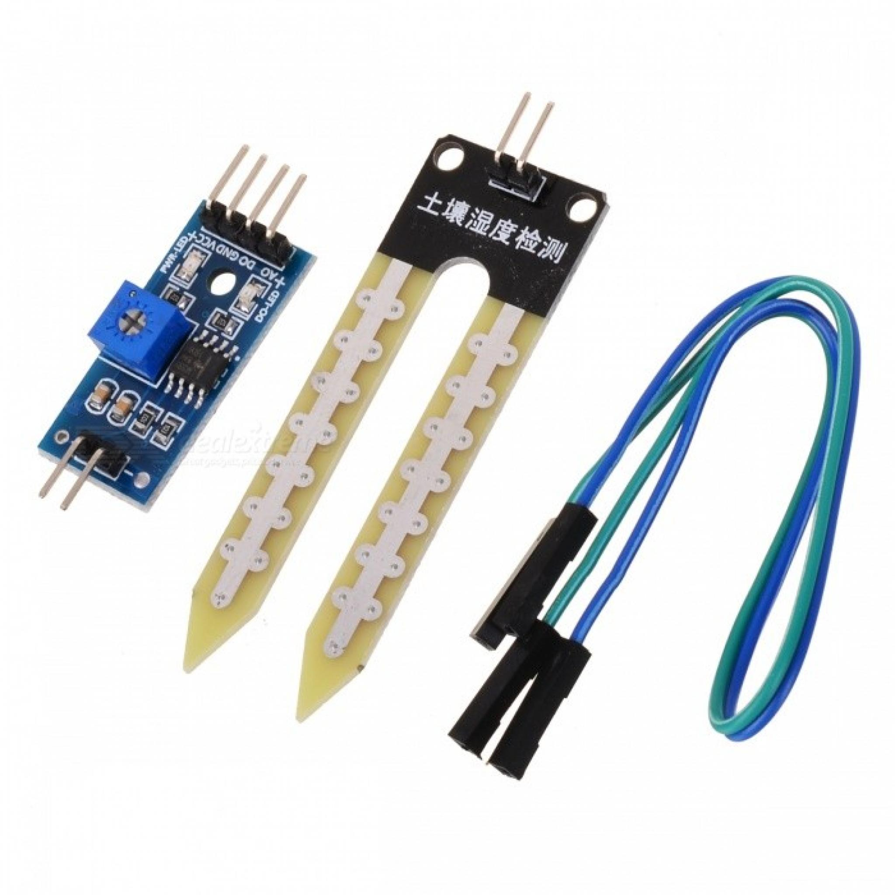
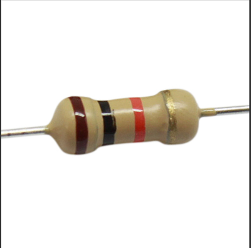

# ⚙️ Componentes del sistema

## 🧠 Electrónica principal

| Componente                  | Descripción                              | Cantidad | Imagen |
|-----------------------------|------------------------------------------|-----------|--------|
| **ESP32 Wemos Lolin32**     | Placa de desarrollo con WiFi y ADC       | 1         |  |
| **Sensor MQ-135**           | Sensor de gases (calidad del aire)       | 1         |  |
| **Sensor Higrómetro**       | Sensor resistivo de humedad del suelo    | 1         |  |
| **Resistencias 10kΩ / 5.1kΩ** | Divisor de voltaje para ADC             | 2         |   |
| **Protoboard**              | Placa para montaje de pruebas            | 1         |  |
| **Cables Dupont**           | Conexiones entre componentes             | Varios    |  |

## 🧰 Software y plataformas
- **Arduino IDE / PlatformIO**  
- **Plataforma Respira:** [http://calidadmedioambiental.org](http://calidadmedioambiental.org)  
- **Documentación Respira:** [para publicación de la documentación](https://panstamp.github.io/respira_fiware/)
