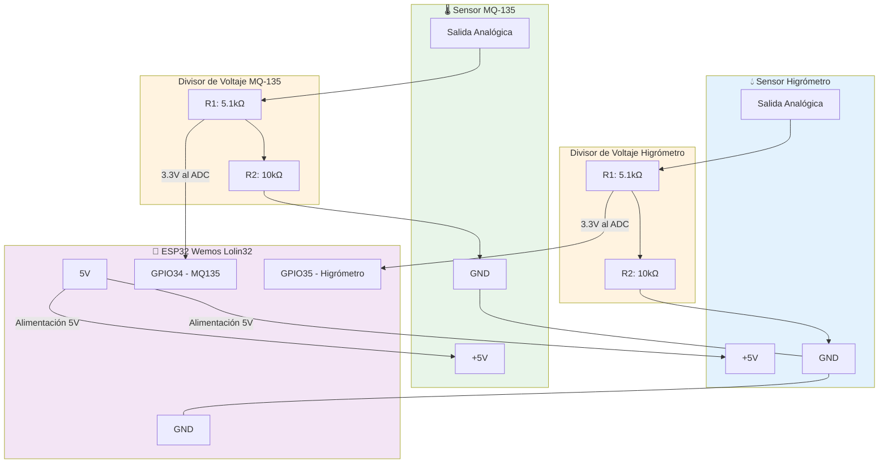

# 🔌 Conexiones del sistema
{: .no_toc }

Esquemas detallados de las conexiones eléctricas entre el ESP32 y los sensores, incluyendo divisores de voltaje.
{: .fs-6 .fw-300 }

## Tabla de contenidos
{: .no_toc .text-delta }

1. TOC
{:toc}

---

## 📐 Diagrama de conexiones

El siguiente diagrama muestra la arquitectura completa del sistema, incluyendo los divisores de voltaje necesarios para proteger el ESP32.



{: .important }
> **¿Por qué necesitamos divisores de voltaje?**
>
> Los sensores operan a 5V, pero el ESP32 solo tolera **3.3V máximo** en sus pines ADC. Sin el divisor de voltaje, **podrías dañar permanentemente el microcontrolador**.

---

## 🔢 Tabla de conexiones

### Sensor MQ-135 (Calidad del aire)

| Componente | Pin origen | Pin destino | Observaciones |
|:-----------|:-----------|:------------|:--------------|
| **VCC** | ESP32 5V | MQ-135 VCC | Alimentación del sensor |
| **AO** | MQ-135 AO | Resistencia 5.1kΩ | Salida analógica |
| **Divisor** | Entre resistencias | ESP32 GPIO34 | Punto medio = 3.3V |
| **GND** | MQ-135 GND | ESP32 GND | Tierra común |

### Sensor Higrómetro (Humedad del suelo)

| Componente | Pin origen | Pin destino | Observaciones |
|:-----------|:-----------|:------------|:--------------|
| **VCC** | ESP32 5V | Higrómetro VCC | Alimentación del sensor |
| **AO** | Higrómetro AO | Resistencia 5.1kΩ | Salida analógica |
| **Divisor** | Entre resistencias | ESP32 GPIO35 | Punto medio = 3.3V |
| **GND** | Higrómetro GND | ESP32 GND | Tierra común |

---

## ⚡ Divisor de voltaje

### Fórmula y cálculo

El divisor de voltaje reduce la señal de 5V a 3.3V usando dos resistencias:

```
V_out = V_in × (R2 / (R1 + R2))
```

**Aplicando nuestros valores:**

```
V_out = 5V × (10kΩ / (5.1kΩ + 10kΩ))
V_out = 5V × (10 / 15.1)
V_out = 5V × 0.662
V_out ≈ 3.31V ✅
```

{: .note }
Este valor está dentro del rango seguro (0-3.3V) para el ESP32.

### Esquema del divisor

```
       5V (Sensor)
          │
          ├───[ R1: 5.1kΩ ]───┐
          │                    │ ← 3.3V al ADC del ESP32
          └───[ R2: 10kΩ ]─────┤
                               │
                              GND
```

---

## 🖥️ Simulación en Tinkercad

Diseño y simulación del circuito completo realizado en Autodesk Tinkercad:


{: .highlight }
**Ventajas de simular antes de montar:**
- Verificar conexiones sin riesgo
- Detectar errores de diseño
- Calcular consumos de corriente
- Probar código virtualmente

[🔗 Acceder a la simulación en Tinkercad](https://www.tinkercad.com){: .btn .btn-blue }

---

## 🛠️ Montaje físico en Protoboard

### Vista general del montaje


{: .note-title }
> Organización del montaje

El circuito está distribuido en la protoboard de la siguiente manera:
- **Lado izquierdo:** Sensor MQ-135 y su divisor de voltaje
- **Centro:** ESP32 Wemos Lolin32
- **Lado derecho:** Sensor Higrómetro y su divisor de voltaje

---

### Detalle del sensor MQ-135


**Puntos clave:**
1. Cable rojo: Alimentación 5V desde ESP32
2. Cable amarillo/naranja: Señal analógica con divisor
3. Cable negro: GND común
4. Resistencias en serie formando el divisor

---

### Detalle del sensor Higrómetro


**Puntos clave:**
1. Sensor insertado en tierra (no sumergir completamente)
2. Divisor de voltaje idéntico al del MQ-135
3. Conexión al GPIO35 del ESP32
4. GND compartido con el resto del sistema

---

### Vista de las conexiones del ESP32


**Pines utilizados:**
- **5V:** Alimentación de ambos sensores
- **GPIO34:** Entrada ADC del MQ-135 (3.3V)
- **GPIO35:** Entrada ADC del Higrómetro (3.3V)
- **GND:** Tierra común de todo el sistema

---

## ✅ Lista de verificación antes de conectar

Antes de alimentar el circuito, verifica:

- [ ] Las resistencias son del valor correcto (5.1kΩ y 10kΩ)
- [ ] El divisor de voltaje está bien conectado
- [ ] No hay cortocircuitos entre VCC y GND
- [ ] Los sensores tienen la polaridad correcta
- [ ] El ESP32 no está conectado aún al USB
- [ ] Todos los cables están firmes en la protoboard
- [ ] GND común conectado entre todos los componentes

{: .warning }
> **⚠️ ADVERTENCIA DE SEGURIDAD**
>
> **NUNCA** conectes 5V directamente a los pines GPIO del ESP32. Siempre usa el divisor de voltaje. Una conexión incorrecta puede destruir el microcontrolador instantáneamente.

---

## 🔍 Solución de problemas

### El sensor no responde

1. Verifica la alimentación con un multímetro
2. Comprueba que el voltaje en el punto medio sea ~3.3V
3. Revisa que no haya cables sueltos

### Lecturas erróneas o inestables

1. Verifica que las resistencias sean las correctas
2. Asegúrate de que el MQ-135 ha precalentado 24h
3. Comprueba las conexiones del divisor de voltaje
4. Revisa que GND esté común en todos los componentes

### El ESP32 no enciende

1. **DESCONECTA INMEDIATAMENTE**
2. Verifica que no haya cortocircuito
3. Asegúrate de que no estás alimentando 5V directo a GPIO
4. Revisa la polaridad de las conexiones

---

## 📊 Consumo eléctrico

| Componente | Voltaje | Corriente típica | Potencia |
|:-----------|:--------|:-----------------|:---------|
| ESP32 | 5V | 80-240 mA | 0.4-1.2W |
| MQ-135 | 5V | 150 mA | 0.75W |
| Higrómetro | 5V | 35 mA | 0.175W |
| **Total** | **5V** | **~425 mA** | **~2.1W** |

{: .note }
Una fuente USB estándar (5V 1A) es suficiente para alimentar todo el sistema.

---

## 🔗 Recursos adicionales

- [Datasheet ESP32 GPIO](https://docs.espressif.com/projects/esp-idf/en/latest/esp32/api-reference/peripherals/gpio.html)
- [Calculadora de divisor de voltaje](https://ohmslawcalculator.com/voltage-divider-calculator)
- [Tutorial Tinkercad](https://www.tinkercad.com/learn)

---

[← Volver a Componentes](componentes){: .btn .btn-outline }
[Ir a Código →](codigo){: .btn .btn-purple }