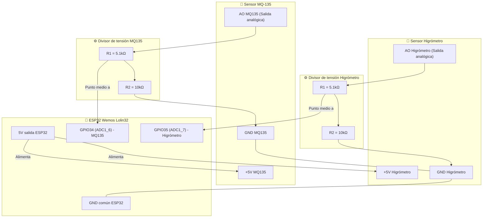
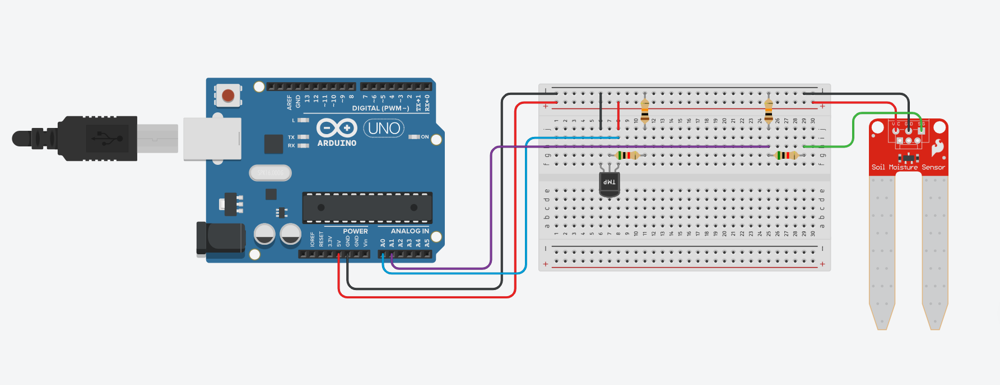
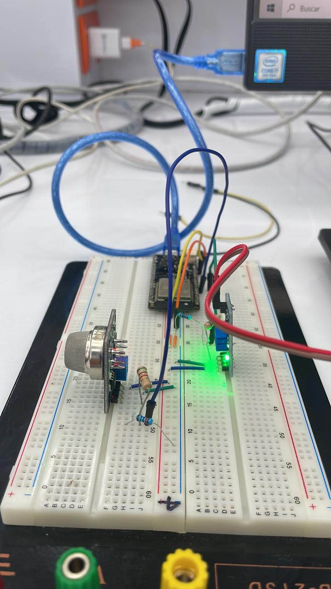
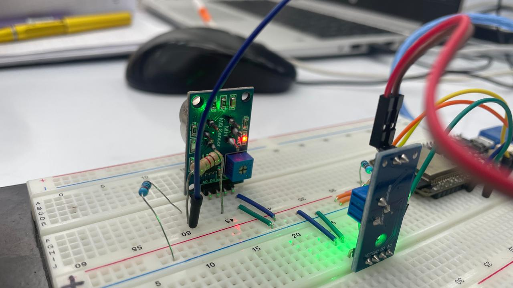
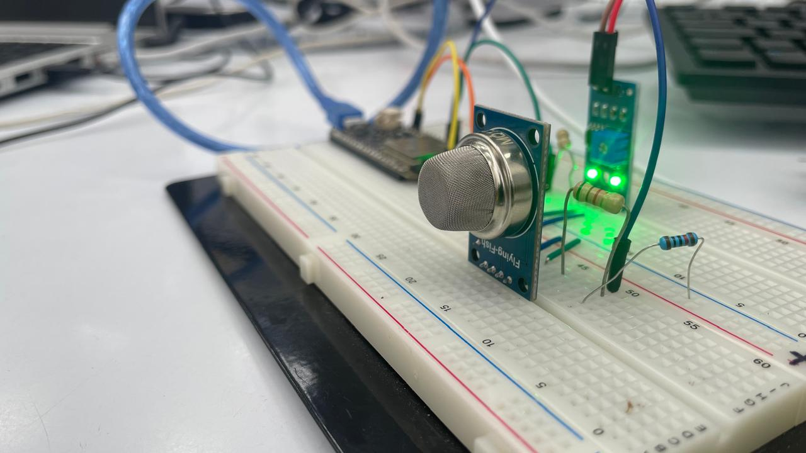
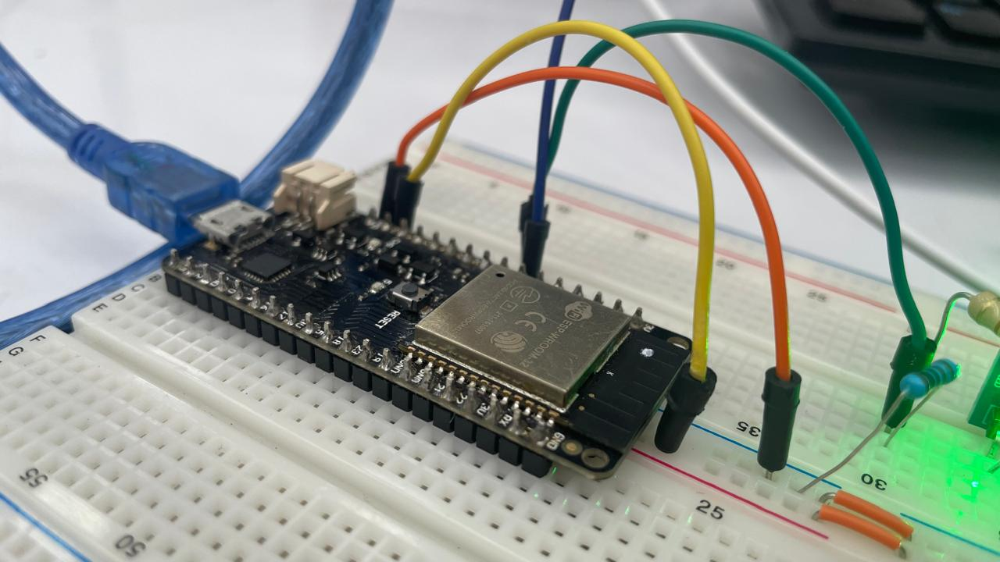

# 🔌 Conexiones del sistema

## Diagrama general

```mermaid
graph TD
    %% ==== SENSOR MQ-135 ====
    subgraph Sensor_MQ135["🔹 Sensor MQ-135"]
        VCC5V["+5V MQ135"]
        AO["AO MQ135 (Salida analógica)"]
        GND_MQ["GND MQ135"]
    end

    %% ==== SENSOR HIGRÓMETRO ====
    subgraph Sensor_Higrometro["🔹 Sensor Higrómetro"]
        VCC_HIGRO["+5V Higrómetro"]
        AO_HIGRO["AO Higrómetro (Salida analógica)"]
        GND_HIGRO["GND Higrómetro"]
    end

    %% ==== DIVISORES MQ135 ====
    subgraph Divisor_MQ135["⚙️ Divisor de tensión MQ135"]
        R1_MQ["R1 = 5.1kΩ"]
        R2_MQ["R2 = 10kΩ"]
    end

    %% ==== DIVISORES HIGRÓMETRO ====
    subgraph Divisor_Higrometro["⚙️ Divisor de tensión Higrómetro"]
        R1_H["R1 = 5.1kΩ"]
        R2_H["R2 = 10kΩ"]
    end

    %% ==== ESP32 ====
    subgraph ESP32_WEMOS_LOLIN32["🧠 ESP32 Wemos Lolin32"]
        VCC_ESP["5V salida ESP32"]
        ADC_MQ["GPIO34 (ADC1_6) - MQ135"]
        ADC_H["GPIO35 (ADC1_7) - Higrómetro"]
        GND_ESP["GND común ESP32"]
    end

    %% ==== CONEXIONES MQ135 ====
    VCC_ESP -->|Alimenta| VCC5V
    AO --> R1_MQ
    R1_MQ -->|Punto medio a| ADC_MQ
    R1_MQ --> R2_MQ
    R2_MQ --> GND_MQ

    %% ==== CONEXIONES HIGRÓMETRO ====
    VCC_ESP -->|Alimenta| VCC_HIGRO
    AO_HIGRO --> R1_H
    R1_H -->|Punto medio a| ADC_H
    R1_H --> R2_H
    R2_H --> GND_HIGRO

    %% ==== MASAS COMUNES ====
    GND_MQ --- GND_HIGRO --- GND_ESP
```
## Montaje

## Protoboard

